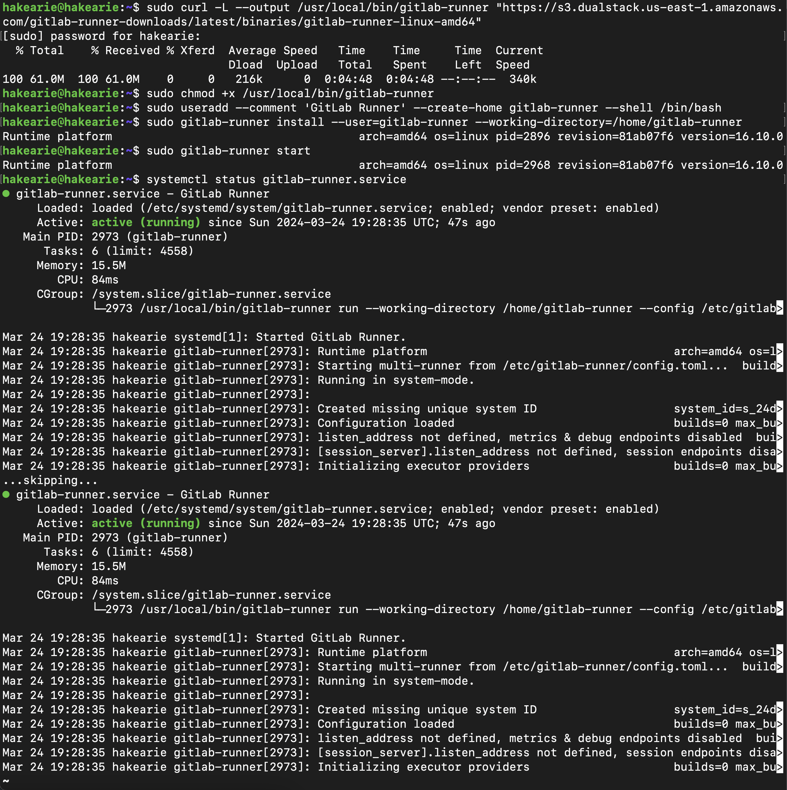

# Отчет о проделанной работе

## Цель работы
Основной целью данного проекта было развертывание системы непрерывной интеграции и развертывания (CI/CD) с использованием GitLab Runner. В ходе выполнения были настроены автоматические сборки, тестирование кодстайла, интеграционные тесты, а также деплой на отдельный сервер.

---

### Part 1. Настройка **gitlab-runner**

1. Поднял виртуальную машину *Ubuntu Server 22.04 LTS*.

2. Скачал и установил на виртуальную машину **gitlab-runner**.

3. Для регистрации понадобятся URL и токен, которые можно получить на страничке задания на платформе.

4. Запустил **gitlab-runner** и зарегистрировал его для использования в текущем проекте (*DO6_CICD*).

### Part 2. Сборка

1. Написал этап для **CI** по сборке приложений из проекта *C2_SimpleBashUtils*.
2. В файле _gitlab-ci.yml_ добавил этап запуска сборки через мейк файл из проекта _C2_.
3. Файлы, полученные после сборки (артефакты), сохрани в произвольную директорию со сроком хранения 30 дней.

4. Результат работы pipeline 

    - Проект успешно забилдился.
    - Исполняемые файлы были сохранены на 30 дней.
### Part 3. Тест кодстайла

1. Написал этап для **CI**, который запускает скрипт кодстайла (*clang-format*).

2. В пайплайне отобразил вывод утилиты *clang-format*, если пайплан прошел.

3. Если кодстайл не прошел, то нужно «зафейлить» пайплайн.

### Part 4. Интеграционные тесты

1. Напиcал этап для **CI**, который запускает интеграционные тесты из того же проекта.

2. Запустил этот этап автоматически только при условии, если сборка и тест кодстайла прошли успешно.

3. Также проверил,что автоматический пропускается,если сборка или тест кодстайл зафейлились.
 
 
 
4. Если тесты не прошли, то пайплайн должен зафейлить.

### Part 5. Этап деплоя

1. Поднял вторую виртуальную машину *Ubuntu Server 22.04 LTS*.

2. Написал этап для **CD**, который «разворачивает» проект на другой виртуальной машине. Этап запускается вручную при условии, что все предыдущие этапы прошли успешно.

3. Написал bash-скрипт, который при помощи **ssh** и **scp** копирует файлы, полученные после сборки (артефакты), в директорию */usr/local/bin* второй виртуальной машины и в файле _gitlab-ci.yml_ добавил этап запуска написанного скрипта.

4. Провел статическую маршрутизацию между двумя машинами и проверил соединение между машинами.

5. Сгенерировал ssh-ключ на раннере и скопировал ssh-ключ на вторую машину.

6. Перезапустил службу раннера командой `sudo systemctl restart gitlab-runner.service`
7. В результате получил готовые к работе приложения из проекта *C2_SimpleBashUtils* (s21_cat и s21_grep) на второй виртуальной машине.

---

## Вывод
В результате выполнения проекта я:
- Освоил установку и настройку GitLab Runner.
- Настроил автоматическую сборку, тестирование и деплой проекта.
- Автоматизировал процесс контроля кодстайла и интеграционного тестирования.
- Организовал развертывание артефактов на удаленный сервер.
- Настроил уведомления о статусе пайплайна в Telegram.

Проект позволил получить практический опыт работы с CI/CD в GitLab, что является важным навыком для DevOps-инженера и системного администратора.